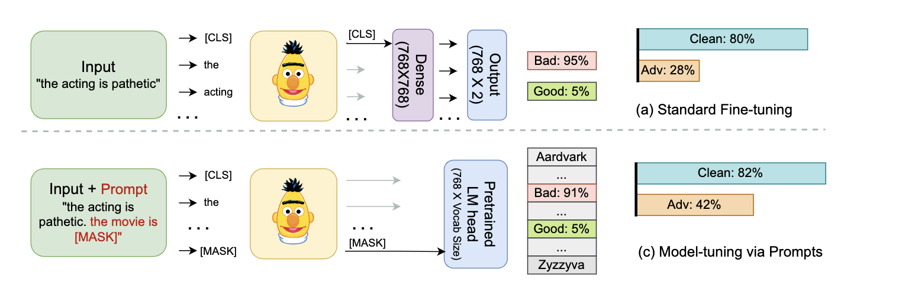

<h1 align="center">Model-tuning Via Prompts Makes NLP Models Adversarially Robust</h1>

This is the PyTorch implementation of the MVP paper. This paper uses the [textattack](https://github.com/QData/TextAttack) library

<p align="center">
 
</p>

>[Model-tuning Via Prompts Makes NLP Models Adversarially Robust](TBD)

>Mrigank Raman*, Pratyush Maini*, Zico Kolter, Zachary Lipton, Danish Pruthi

## Setup
This repository requires Python 3.8+ and Pytorch 1.11+ but we recommend using Python 3.10 and installing the following libararies

    conda create -n MVP python=3.10
    pip install torch==1.12.1+cu116 --extra-index-url https://download.pytorch.org/whl/cu116
    pip install torch-scatter -f https://data.pyg.org/whl/torch-1.12.0+cu116.html
    pip install textattack[tensorflow]
    
    
## Training and Testing
In the following you can replace mvp after roberta-base with any one of (projectcls, lpft, lpft_dense, clsprompt, mlp_ft) to run the corresponding model

### Training without Adversarial Augmentation :

```
CUDA_VISIBLE_DEVICES=2 bash scripts/train_1_seed.sh 8 boolq roberta-base mvp 20 1e-5 max mean max mean configs/templates_boolq.yaml configs/verbalizer_boolq.yaml mvp_seed_0 textfooler train -1 1 0.1
```

### Training with Adversarial Augmentation :

```
CUDA_VISIBLE_DEVICES=2,3 bash scripts/train_adv_1_seed.sh 8 boolq roberta-base mvp 20 1e-5 max mean max mean configs/templates_boolq.yaml configs/verbalizer_boolq.yaml mvp_adv textfooler train -1 1 0.1 1 l2 1
```

### Testing:
 

```
CUDA_VISIBLE_DEVICES=2 bash scripts/test_1_seed.sh 8 boolq roberta-base mvp 20 1e-5 max mean max mean configs/templates_boolq.yaml configs/verbalizer_boolq.yaml mvp_seed_0 textfooler train -1 1 0.1
```

### Model Checkpoints

| Model Name | BoolQ |
|------------|----------|
| MLP-FT     | [mlp-ft.zip](https://drive.google.com/file/d/1__TCH6GXrSqiqUzSIYtLaJfc8TU0wiIJ/view?usp=sharing)|
| MVP        | [mvp.zip](https://drive.google.com/file/d/1XnBwVY5Mw99ClgVQTffS0ttwv7HbpWMZ/view?usp=sharing) |
| MVP+Adv    | [mvp-adv.zip](https://drive.google.com/file/d/13LXNAQkarQkeWD57M7o1QPSV8Ol5s-pr/view?usp=sharing) |
| ProjectCLS | [projectcls.zip](https://drive.google.com/file/d/1qqLvswIxzC2aHmjty5xtzQv96-RnzkF8/view?usp=sharing) |
| CLSPrompt  | [clsprompt.zip](https://drive.google.com/file/d/10-ibOfL83RZoaQ7TcMoZ_mj0ddgh6_hE/view?usp=sharing) |
| LPFT       | [lpft.zip](https://drive.google.com/file/d/1A48rolSF2fDYJL4YIiJiafK_0zbvPTM2/view?usp=sharing) |


To download the checkpoints just run the following command


```
bash downloader.sh $FILENAME $FILEID
```

$FILEID can be found from the corresponding links and $FILENAME is the name with which you want to save the file.


## Citation

Please concider citing our paper if you use MVP in your work:
```
@inproceedings{raman2023mvp,
	title={Model-tuning Via Prompts Makes NLP Models Adversarially Robust}, 
	author={Mrigank Raman and Pratyush Maini and J. Zico Kolter and Zachary Chase Lipton and Danish Pruthi},
	journal={arXiv preprint arXiv:2303.07320},
  year={2023}
}
```


    
